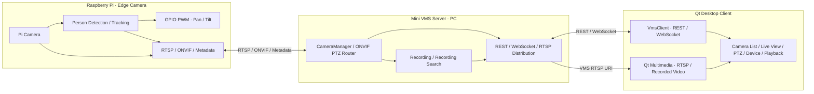

# Mini VMS Desktop Client

Raspberry Pi 기반 Edge AI PTZ 카메라를 PC의 VMS 서버를 통해 모니터링하는 **Qt 6 Widgets / C++17** 데스크톱 클라이언트입니다. 기존 영상·PTZ 위젯을 재사용하고 카메라 접속, 녹화, ONVIF 처리는 별도 VMS 서버가 담당합니다.

## 시스템 구조



Qt 기본 실행 파일은 Pi에 직접 접속하지 않습니다. 검색·등록·PTZ는 VMS API를 사용하고 라이브 영상은 VMS가 반환한 RTSP 주소로 재생합니다. WebRTC는 기본 Qt 클라이언트에서 사용하지 않습니다. 그림의 Pi AI·메타데이터 기능은 시스템 설계이며 실제 동작은 Pi와 서버 구현에 달려 있습니다.

## 현재 기능

| 기능 | 구현 상태 |
|---|---|
| VMS 연결 | WebSocket 연결·해제, 카메라 목록·상태 갱신 |
| 검색·등록 | VMS를 통한 ONVIF 검색, 발견 목록의 RTSP 주소 표시, ADD CAMERA |
| 라이브 | REST로 스트림 URI 조회 → Qt Multimedia 재생, RTSP TCP / UDP 선택 |
| PTZ | 버튼·방향키·W/A/S/D 누름/놓음, 200ms 갱신, C/R 중앙 복귀 |
| 안전 정지 | 포커스 상실·창 비활성화·카메라 전환·연결 해제 시 STOP 요청 |
| 녹화 | 서버 녹화 시작·종료 요청, 날짜·시간별 녹화 목록 검색 |
| 녹화 재생 | 완료된 로컬 파일 선택·재생, Play/Pause/Stop 및 탐색 |
| 장치·로그 | DEVICE 상태·스트림 통계, SYSTEM LOG, 상단 도움말 |
| Dummy Mode | 서버 없이 샘플 영상·이벤트·타임라인 확인 |
| Tracking / EVENTS | 실제 서버 기능 미지원으로 비활성화; Dummy에서 UI 확인 |

PTZ는 서버의 카메라 capability에 따라 활성화됩니다. `PTZ TX`는 전송, `PTZ VMS`는 서버 승인, `PTZ PI`는 Pi ONVIF 응답입니다. Pi 응답은 모터의 목표 위치 도달 확인이 아닙니다.

## 화면 구성

```text
┌─────────────────────────────────────────────────────────────┐
│ Edge AI PTZ Mini VMS                Dummy Mode / VMS / ?     │
├──────────────┬──────────────────────────────┬─────────────────┤
│ CAMERAS      │ LIVE VIEW                    │ PTZ CONTROL     │
│ Camera List  │ RTSP TCP / UDP · Start/Stop   │ Buttons / Keys  │
│ Online / REC │ REC START / REC STOP         │ Tracking Info   │
├──────────────┴──────────────────────────────┴─────────────────┤
│ EVENTS │ PLAYBACK │ DEVICE │ SYSTEM LOG                      │
├─────────────────────────────────────────────────────────────┤
│ VMS / Camera / Stream / Recording Status                     │
└─────────────────────────────────────────────────────────────┘
```

## 빌드

필요 환경: CMake 3.21 이상, C++17, Qt 6 **Widgets / Network / WebSockets / Multimedia**. Windows 권장 Kit은 Qt 6.11.2 **MSVC 2022 x64**입니다. 기본 빌드에는 Qt WebEngine이나 별도의 FFmpeg 개발 라이브러리가 필요하지 않습니다. 영상은 Qt Multimedia의 FFmpeg 백엔드를 사용합니다.

Qt Creator에서 **저장소 최상위 [CMakeLists.txt](CMakeLists.txt)** 를 프로젝트로 열고 MSVC Kit을 선택합니다. 빌드 대상은 `PTZCamera`, 실행 파일은 `MiniVmsClient.exe`입니다.

MSVC 환경이 설정된 터미널에서:

```powershell
cmake -S . -B build-vms -G Ninja -DCMAKE_BUILD_TYPE=Debug -DCMAKE_PREFIX_PATH="C:/Qt/6.11.2/msvc2022_64"
cmake --build build-vms --target PTZCamera --parallel
C:\Qt\6.11.2\msvc2022_64\bin\windeployqt.exe .\build-vms\PTZCamera\MiniVmsClient.exe
.\build-vms\PTZCamera\MiniVmsClient.exe --no-dummy
```

Qt 설치 경로는 실제 설치 위치에 맞춥니다. Qt Creator 실행 시에는 Kit의 DLL 경로를 사용합니다.

## 실행 순서

1. Pi 카메라와 ONVIF 서비스를 실행합니다.
2. PC에서 별도 Mini VMS 서버를 실행합니다.
3. DEVICE 탭에서 VMS Host/Port를 입력하고 Connect를 누릅니다. 기본값은 `127.0.0.1:5000`입니다.
4. 기존 카메라를 선택하거나 DISCOVER CAMERAS → 발견 장치 선택 → ADD CAMERA로 등록합니다.
5. 라이브 Start를 누릅니다. 녹화는 REC START / REC STOP, 검색·재생은 PLAYBACK 탭을 사용합니다.

기본 실행은 Dummy Mode입니다. 실제 장치 사용 시 체크를 해제하거나 `--no-dummy`로 실행합니다. 현재 녹화 재생은 같은 PC의 완료된 파일 또는 OPEN FILE로 선택한 로컬 사본을 사용합니다. 원격 서버의 파일 경로를 로컬 경로로 자동 해석하지 않습니다.

## 코드 구조

```text
Qt_Client/
├── CMakeLists.txt                 # Qt Creator에서 여는 진입점
├── README.md
├── docs/                         # 아키텍처·세션 기록
└── PTZCamera/
    ├── CMakeLists.txt
    ├── app/                      # MainWindow: 배치와 signal/slot 연결
    ├── network/                  # VmsClient: REST / WebSocket
    ├── camera/                   # 카메라 목록·QPainter 영상·RTSP 재생
    ├── ui/                       # PTZ 입력/갱신·Tracking·도움말·상태
    ├── device/                   # VMS 연결·검색/등록·통계
    ├── playback/                 # 녹화 검색 결과·로컬 영상 재생
    ├── events/                   # 이벤트 검색 UI
    ├── log/                      # System Log
    ├── model/                    # Camera / Detection / Recording 정보
    ├── demo/                     # 네트워크와 분리한 Dummy 데이터
    ├── legacy/                   # 이전 Pi 직접 연결 화면, 기본 빌드 제외
    ├── resources/                # Dark Theme stylesheet
    ├── tests/                    # UI·WebSocket 자동 테스트
    └── docs/tech-decisions/       # 기술 선택·대안·검증 한계
```

## 테스트

```powershell
cmake -S . -B build-vms -DPTZ_BUILD_TESTS=ON
cmake --build build-vms --parallel
ctest --test-dir build-vms --output-on-failure
```

기존 빌드 디렉터리의 Kit·Generator를 사용합니다. 테스트에는 Qt Test가 추가로 필요합니다. Linux Qt 환경에서 앱 빌드와 `MiniVmsUiTests`, `VmsWebSocketTests`가 통과했습니다. Windows/MSVC 실행 및 실제 Pi 서보 동작은 추가 확인이 필요합니다. 지연 시간은 측정 결과가 없어 수치로 보장하지 않습니다.

[개발·진단 안내](PTZCamera/README.md) · [아키텍처 기록](docs/QT_VMS_CLIENT_ARCHITECTURE.md) · [세션 기록](docs/SESSION_2026-10-08.md) · [PTZ 기술 결정](PTZCamera/docs/tech-decisions/0011-vms-ptz-input.md)
