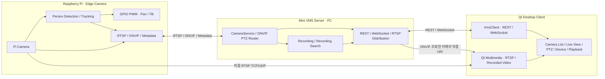
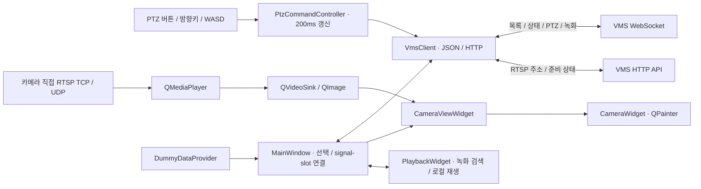

# Mini VMS Desktop Client

Raspberry Pi 영상은 직접 RTSP로 수신하고 제어·메타데이터·녹화·검색은 PC VMS를 통해 처리하는 **Qt 6 Widgets / C++17** 데스크톱 클라이언트입니다. 기존 영상·PTZ 위젯을 재사용하고 카메라 접속, 녹화, ONVIF 처리는 별도 VMS 서버가 담당합니다.

## 시스템 구조



Qt 라이브는 Pi에 직접 RTSP로 연결합니다. VMS가 ONVIF로 조회한 카메라 URI를 direct-stream API에서 제공하며 검색·등록·PTZ·메타데이터·녹화는 VMS에 유지합니다. WebRTC는 기본 Qt 클라이언트에서 사용하지 않습니다.

## 클라이언트 내부 구조



`MainWindow`는 화면 선택과 연결을 담당하고, 통신 파싱은 `VmsClient`, PTZ 입력 갱신은 `PtzCommandController`, 영상 디코딩은 Qt Multimedia가 담당합니다. 녹화 파일은 클라이언트에서 접근 가능한 로컬 파일로 재생합니다.

## 현재 기능

| 기능 | 구현 상태 |
|---|---|
| VMS 연결 | WebSocket 연결·해제, 카메라 목록·상태 갱신 |
| 검색·등록 | VMS를 통한 ONVIF 검색, 발견 목록의 RTSP 주소 표시, ADD CAMERA |
| 라이브 | REST로 스트림 URI 조회 → Qt Multimedia 재생, RTSP TCP / UDP 선택 |
| PTZ | 버튼·방향키·W/A/S/D 누름/놓음, 200ms 갱신, C/R 중앙 복귀 |
| 안전 정지 | 포커스 상실·창 비활성화·카메라 전환·연결 해제 시 STOP 요청 |
| 녹화 | 수동 시작·종료, Tracking ON + 탐지 자동 녹화 모드 선택, 날짜·시간별 완료 파일 검색 |
| 녹화 재생 | 완료된 로컬 파일 재생, Play/Pause/Stop·탐색, 탐지 2초 전 재생 옵션 |
| 장치·진단 | DEVICE·SYSTEM LOG·도움말, 마지막 metadata 수신/저장 시각·샘플 수·녹화 상태 |
| Dummy Mode | 서버 없이 샘플 영상·이벤트·타임라인 확인 |
| 실시간 메타데이터 | VMS 알림으로 bbox·confidence·추적 상태·명령 각도 표시; 오래된 bbox 제거 |
| EVENTS | 상태 이력/탐지 샘플 검색, confidence 필터·페이지네이션·연결 녹화 재생 |
| CHAT SEARCH | VMS 자연어 검색, 결과 선택·다음 페이지·녹화 재생 |

Tracking ON/OFF는 지원 카메라에서 활성화됩니다. 요청/Pi 응답과 실제 metadata 상태를 구분하며 수동 PTZ는 추적을 해제합니다. 이벤트 재생은 offsetMs를 사용하고 추정 시각이면 표시합니다. 녹화 파일은 같은 PC에서 접근해야 합니다.

PTZ는 서버의 카메라 capability에 따라 활성화됩니다. `PTZ TX`는 전송, `PTZ VMS`는 서버 승인, `PTZ PI`는 Pi ONVIF 응답입니다. Pi 응답은 모터의 목표 위치 도달 확인이 아닙니다.

## 화면 구성

```text
┌─────────────────────────────────────────────────────────────┐
│ Edge AI PTZ Mini VMS                Dummy Mode / VMS / ?     │
├──────────────┬──────────────────────────────┬─────────────────┤
│ CAMERAS      │ LIVE VIEW                    │ PTZ CONTROL     │
│ Camera List  │ RTSP TCP / UDP · Start/Stop   │ Buttons / Keys  │
│ Online / REC │ REC START / REC STOP         │ Tracking Info   │
├──────────────┴──────────────────────────────┴─────────────────┤
│ EVENTS │ PLAYBACK │ DEVICE │ SYSTEM LOG │ CHAT SEARCH        │
├─────────────────────────────────────────────────────────────┤
│ VMS / Camera / Stream / Recording Status                     │
└─────────────────────────────────────────────────────────────┘
```

## 빌드

필요 환경: CMake 3.21 이상, C++17, Qt 6 **Widgets / Network / WebSockets / Multimedia**. Windows 권장 Kit은 Qt 6.11.2 **MSVC 2022 x64**입니다. 기본 빌드에는 Qt WebEngine이나 별도의 FFmpeg 개발 라이브러리가 필요하지 않습니다. 영상은 Qt Multimedia의 FFmpeg 백엔드를 사용합니다.

Qt Creator에서 **저장소 최상위 [CMakeLists.txt](CMakeLists.txt)** 를 프로젝트로 열고 MSVC Kit을 선택합니다. 빌드 대상은 `PTZCamera`, 실행 파일은 `MiniVmsClient.exe`입니다.

MSVC 환경이 설정된 터미널에서:

```powershell
cmake -S . -B build-vms -G Ninja -DCMAKE_BUILD_TYPE=Debug -DCMAKE_PREFIX_PATH="C:/Qt/6.11.2/msvc2022_64"
cmake --build build-vms --target PTZCamera --parallel
C:\Qt\6.11.2\msvc2022_64\bin\windeployqt.exe .\build-vms\PTZCamera\MiniVmsClient.exe
.\build-vms\PTZCamera\MiniVmsClient.exe --no-dummy
```

Qt 설치 경로는 실제 설치 위치에 맞춥니다. Qt Creator 실행 시에는 Kit의 DLL 경로를 사용합니다.

## 실행 순서

1. Pi 카메라와 ONVIF 서비스를 실행합니다.
2. PC에서 별도 Mini VMS 서버를 실행합니다.
3. DEVICE 탭에서 VMS Host/Port를 입력하고 Connect를 누릅니다. 기본값은 `127.0.0.1:5000`입니다.
4. 기존 카메라를 선택하거나 DISCOVER CAMERAS → 발견 장치 선택 → ADD CAMERA로 등록합니다.
5. 라이브 Start를 누릅니다. 녹화는 REC START / REC STOP, 검색·재생은 PLAYBACK 탭을 사용합니다.

기본 실행은 Dummy Mode입니다. 실제 장치 사용 시 체크를 해제하거나 `--no-dummy`로 실행합니다. 현재 녹화 재생은 같은 PC의 완료된 파일 또는 OPEN FILE로 선택한 로컬 사본을 사용합니다. 원격 서버의 파일 경로를 로컬 경로로 자동 해석하지 않습니다.

## 코드 구조

```text
Qt_Client/
├── CMakeLists.txt                 # Qt Creator에서 여는 진입점
├── README.md
├── docs/                         # 아키텍처·세션 기록
└── PTZCamera/
    ├── CMakeLists.txt
    ├── app/                      # MainWindow: 배치와 signal/slot 연결
    ├── network/                  # VmsClient: REST / WebSocket
    ├── camera/                   # 카메라 목록·QPainter 영상·RTSP 재생
    ├── ui/                       # PTZ 입력/갱신·Tracking·도움말·상태
    ├── device/                   # VMS 연결·검색/등록·통계
    ├── playback/                 # 녹화 검색 결과·로컬 영상 재생
    ├── events/                   # 이벤트 검색 UI
    ├── chat/                     # 자연어 검색·결과 선택
    ├── log/                      # System Log
    ├── model/                    # Camera / Detection / Recording 정보
    ├── demo/                     # 네트워크와 분리한 Dummy 데이터
    ├── legacy/                   # 이전 Pi 직접 연결 화면, 기본 빌드 제외
    ├── resources/                # Dark Theme stylesheet
    ├── tests/                    # UI·WebSocket 자동 테스트
    └── docs/tech-decisions/       # 기술 선택·대안·검증 한계
```

## 테스트

```powershell
cmake -S . -B build-vms -DPTZ_BUILD_TESTS=ON
cmake --build build-vms --parallel
ctest --test-dir build-vms --output-on-failure
```

기존 빌드 디렉터리의 Kit·Generator를 사용합니다. 테스트에는 Qt Test가 추가로 필요합니다. Linux에서는 UI·WebSocket 및 실제 VMS와의 검색 계약을 검증하고, Windows Qt 6.11/MSVC에서는 모의 서버·합성 녹화 파일로 검증합니다. 실제 Pi 영상·메타데이터·서보 및 장시간 시험은 사용자가 수행합니다. 지연 시간은 수치로 보장하지 않습니다.

[개발·진단 안내](PTZCamera/README.md) · [아키텍처 기록](docs/QT_VMS_CLIENT_ARCHITECTURE.md) · [세션 기록](docs/SESSION_2026-10-08.md) · [PTZ 기술 결정](PTZCamera/docs/tech-decisions/0011-vms-ptz-input.md)

## 관련 프로젝트

| 저장소 | 역할 |
|---|---|
| [PTZ_VMS_Server](https://github.com/PTZ-CAMERA/PTZ_VMS_Server) | 카메라 수신·RTSP 중계·등록·녹화·ONVIF PTZ |
| [Qt_Client](https://github.com/PTZ-CAMERA/Qt_Client) | Qt 데스크톱 화면과 VMS 클라이언트 |
| [PTZ_WEB_Client](https://github.com/PTZ-CAMERA/PTZ_WEB_Client) | WebRTC 영상·PTZ용 브라우저 화면 |

Web 영상은 VMS 내장 libdatachannel WebRTC를 사용합니다. PC MediaMTX 게이트웨이는 제거했습니다. Web 녹화 재생은 제외하고 Qt 로컬 녹화 재생은 유지합니다.

## 자동 녹화·진단·재생

오른쪽 자동 녹화 체크박스는 SET_AUTO_RECORDING으로 VMS 모드를 변경합니다. Pi metadata로 확인된 Tracking ON과 사람 탐지가 함께 있어야 자동 시작하며 소실 후 기본 10초 종료, 재탐지 유지, 수동 녹화 보호를 VMS가 처리합니다. 진단은 GET_METADATA_STATUS로 2초마다 조회하고 오래된 탐지 상태는 미확인으로 표시합니다.

녹화 중 파일은 확정 대기, 녹화가 없는 시각은 재생 불가로 표시합니다. Playback의 2초 사전 재생은 동일 완료 파일 범위에만 적용하며 receive_estimated 위치를 정확한 탐지 프레임으로 표시하지 않습니다. 원격 파일 전송 기능은 아직 없습니다.

## Pi 소스 버전 확인

현재 VMS는 Tracking ON/OFF에 기존 ONVIF MoveAndStartTracking/Stop을 사용합니다. 최신 Pi 소스의 /camera/control tracking_set/get 및 Stop 후 자동 복귀 동작을 적용할 때는 VMS adapter를 맞춰야 합니다. Qt는 VMS 명령을 사용하고 Pi에 별도 GPIO/추적 제어를 구현하지 않습니다. 최신 Pi 배포와 실제 Tracking OFF의 전체 연동은 추가 확인 대상입니다.

## 검증 범위

Qt Linux UI/WS, Windows Qt 6.11/MSVC mock 서버·합성 영상의 ms 탐색·2초 사전 재생·자동 모드 응답 시험을 통과했습니다. 실제 Pi 탐지→자동 녹화→자연어 검색→재생 전체 실물 시험과 장시간 시험은 별도입니다.

관련 Pi 저장소: [PTZ_CAMERA](https://github.com/PTZ-CAMERA/PTZ_CAMERA).
