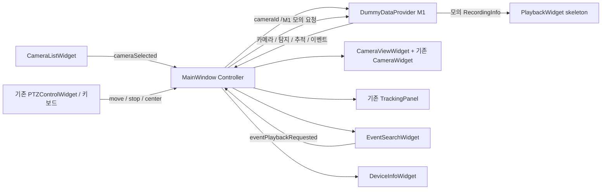

> 2026-10-08: GET URL/COPY를 제거했다. DISCOVERED CAMERAS 옆에 VMS 할당 RTSP 주소와 등록/준비 상태를 표시하고 ADD CAMERA로 실제 등록·연결한다. 검색 응답의 추가 필드와 양쪽 검증은 [0010](../PTZCamera/docs/tech-decisions/0010-discovered-camera-stream-address.md)을 따른다. 아래 이전 기록의 수동 주소 조회 설명은 이 흐름으로 대체됐다.
>
> 2026-10-07 최신 연동: Qt는 VMS RTSP, ONVIF 검색/등록 및 녹화 시작·중지·검색 API를 사용한다. 동일 PC의 녹화 파일을 선택해 실제 재생하며 OPEN FILE로 직접 선택할 수도 있다. 원격 재생 API는 아직 없다. 상단 ? / F1으로 사용 도움말을 연다. 재생 결정/검증은 [0008](../PTZCamera/docs/tech-decisions/0008-local-recording-playback.md), 통신 계약은 [0007](../PTZCamera/docs/tech-decisions/0007-supported-vms-ui.md)을 따른다. PTZ/Tracking/EVENTS는 실제 VMS 모드에서 비활성화하고 WebRTC는 선택할 수 없다.
>
> 2026-10-07 WebSocket 후속 구현: 현재 기본 UI에 network/VmsClient를 연결했다.
> VMS list/status query, notification, timeout/heartbeat, disconnect/Dummy 정리를 구현한다.
> 서버 주소는 ws://127.0.0.1:5000/ws. 기술 결정은
> [0006](../PTZCamera/docs/tech-decisions/0006-vms-websocket-api.md).
> 아래 M1-only 분석은 당시 상태를 기록한 것이며 현재 통신 기능은 위 후속 구현을 따른다.

# Mini VMS Desktop Client 구조 분석과 MILESTONE 1

## 변경 전 구현 분석

| 클래스/파일 | 역할 | 재사용 또는 보존 방법 |
| --- | --- | --- |
| `app/MainWindow` | 레이아웃, 버튼/키보드, TCP 응답 연결, 정보 표시, 데모 생성 | 기본 창은 VMS Controller로 정리하고 기존 창은 `legacy/LegacyMainWindow`로 보존 |
| `camera/CameraWidget` | QImage와 탐지 상자/객체·프레임 중심을 QPainter로 그림 | 새 `CameraViewWidget` 내부에서 그대로 사용 |
| `camera/CameraPlaybackWidget` | 데모/RTSP/WebRTC 페이지 전환, ONVIF 설정 토글, 프레임 타임아웃 | legacy 실행 경로에 보존; 후속 StreamController 분리의 출발점 |
| `camera/rtsp/RtspPlayerWidget` | QMediaPlayer/QVideoWidget, TCP/UDP 선택, 프레임/오류 신호 | 보존; M6에서 VMS 제공 URI에 연결 |
| `camera/webrtc/WebRtcPlayerWidget` | QWebEngineView, video 프레임 통계 검사 | 보존; M6에서 VMS WebRTC 페이지에 연결, native libwebrtc 추가 없음 |
| `ui/PTZControlWidget` | 방향/중앙 복귀 버튼 | pressed/released 기반 move/stop 신호 추가; legacy 방향 신호도 보존 |
| `ui/TrackingPanel` | ON/OFF와 IDLE/TRACKING/LOST | 재사용, 서버가 보내는 추적 정보 표시 API 추가 |
| `ui/ConnectionStatusWidget` | Pi TCP 5000 입력과 LED | VMS 용도 선택 추가, DEVICE 탭에서는 기본 127.0.0.1:5000 표시 |
| `camera/OnvifPanelWidget` | 장치 목록, 서비스 URL, 인증, RTSP URL 조회 | legacy에 보존; 새 DEVICE는 VMS의 장치 상태/조회 요청을 표시 |
| `network/onvif/OnvifClient` | WS-Discovery, SOAP GetServices/GetCapabilities/GetProfiles/GetStreamUri | 보존, 기본 VMS 화면에서 직접 호출하지 않음; ONVIF PTZ는 현재 미구현 |
| `network/NetworkClient` | QTcpSocket과 newline 텍스트 PTZ/TRACK/DETECT | legacy에 보존; VMS API로 재사용 가능한 소켓 처리 패턴 분석 자료 |
| `model/TrackingInfo` | 탐지 좌표, 오차, 각도 | VMS 추적 필드 추가, 기존 필드는 legacy 호환을 위해 유지 |

기존 MainWindow는 왼쪽 카메라와 오른쪽 Connection/Tracking/PTZ/Object 패널, 하단 QPlainTextEdit로 구성돼 있었다. 기존 CameraWidget은 데모의 QImage만 표시하고, 실영상은 별도 QVideoWidget/WebEngine 페이지에 표시됐다. 따라서 기존 실영상에 바운딩 박스가 이미 통합돼 있다고 간주하지 않는다.

## 목표 경계와 최소 변경

최종 통신 경계는 `Qt Client → VMS Server → Pi`다. 기본 앱에서 Pi 주소, 직접 ONVIF 검색, 직접 PTZ TCP 송신을 실행하지 않는다. 직접 연결 코드를 삭제하는 대신 별도 legacy 대상에 보존한다.

M1의 MainWindow는 위젯 생성/배치, cameraId 선택과 signal/slot 연결만 담당한다. TCP/JSON/SOAP/SQL 파싱, 디코딩, 녹화 검색 구현은 넣지 않는다. Dummy 데이터와 조회는 `DummyDataProvider`, 로그 형식은 `SystemLogWidget`, 키보드 처리는 `PtzKeyboardController`로 분리한다.

새 UI는 왼쪽 CameraListWidget, 중앙 CameraViewWidget, 오른쪽 기존 PTZ/Tracking, 하단 EVENTS/PLAYBACK/DEVICE/SYSTEM LOG 탭이다. 상단 Dummy Mode 표시와 VMS 상태, 하단 VMS/카메라/스트림/녹화 상태는 각각 구분한다. 창 기본 1400×850, 최소 1200×750은 유지한다. 하단 탭과 중앙 화면의 경계는 세로 splitter로 조절한다.

## M1 클래스와 신호 흐름

| 클래스 | 책임 |
| --- | --- |
| `CameraInfo`, `DetectionInfo`, `EventInfo`, `RecordingInfo` | cameraId 기반 화면 데이터; VMS wire protocol을 정의하지 않음 |
| `CameraListWidget` | 목록·ONLINE/REC·현재 선택 표시, `cameraSelected(id)` |
| `CameraViewWidget` | 기존 CameraWidget 재사용, 카메라 이름/영상 상태/REC/Stream 선택 |
| `PTZControlWidget` | 누름 `moveRequested(pan, tilt)`, 놓음 `stopRequested()`, Center |
| `PtzKeyboardController` | 방향키 누름/놓음과 R, 포커스 이탈 시 Stop |
| `TrackingPanel` | updateTrackingInfo, 사용자 trackingChanged; 상태 반영은 명령 신호를 재발행하지 않음 |
| `EventSearchWidget` | 날짜/시간/카메라/종류 검색 조건과 QTableView, 더블클릭 재생 요청 |
| `PlaybackWidget` | 녹화 검색 UI와 재생 화면 skeleton, 타임라인/시간/제어 버튼 |
| `DeviceInfoWidget` | 선택 장치 정보와 VMS Refresh/Discover 요청 의도 |
| `ConnectionStatusWidget` | VMS Host/Port/Connect/Disconnect UI; M1에 실제 연결 없음 |
| `SystemLogWidget` | `[HH:mm:ss][SOURCE] message`와 자동 스크롤 |
| `StatusIndicatorWidget` | 회색/초록/빨강으로 개별 상태 표시 |
| `DummyDataProvider` | 카메라/탐지/추적/이벤트/녹화 샘플과 로컬 모의 조회; 소켓 없음 |

## 단계별 후속 구현

- M1: 이 문서의 UI와 Dummy Mode. 영상/연결/녹화는 모의 상태로 명시한다. 실제 서버가 없으면 요청을 성공했다고 표시하지 않는다.
- M2: 합의된 VMS API로 VmsClient(QTcpSocket 우선), cameraId별 상태/metadata 전달. 현재 newline Pi 프로토콜을 VMS API로 임의 채택하지 않는다.
- M3: UI move/stop/center를 VmsClient에 연결. Pi ONVIF 서비스 지원과 좌표 공간은 VMS Server가 처리한다.
- M4: 이벤트 검색 요청/결과를 VMS 서버에 연결.
- M5: 서버의 녹화 조회/Playback URI를 실제 재생에 연결. Qt에서 SQLite를 열지 않는다.
- M6: StreamController 인터페이스와 기존 RTSP/WebRTC 플레이어를 결합하고 VMS 제공 streamUri만 사용한다. 실영상 metadata 좌표 동기화도 이때 검증한다.

## 보존 및 실행

기존 소켓/ONVIF/플레이어 및 직접 연결 창은 제거하지 않는다. `PTZ_BUILD_LEGACY_CLIENT=ON`에서 `PTZCameraLegacy`를 별도로 빌드한다. 기본 `PTZCamera` 대상의 실행 파일명은 `MiniVmsClient`이며 기존 CMake 진입점을 유지한다. 기본 화면은 Dummy Mode로 시작하고 이를 끄면 실제 VMS 연결 전의 빈/Disconnected 상태를 표시한다.

Windows: Qt Creator에서 최상위 CMakeLists.txt를 MSVC 2022 x64 Kit으로 열어 `PTZCamera`를 실행한다. 후속 실영상/legacy 확인에는 `PTZ_WITH_WEBENGINE=ON`, Widgets/Network/Multimedia/MultimediaWidgets/WebEngineWidgets 모듈을 사용한다. Linux 진단 빌드는 같은 CMake로 가능하지만 Windows MSVC 실행 검증과는 별개다.

## 이번 변경 파일

기존 파일 수정: `PTZCamera/app/MainWindow.h/.cpp`, `app/main.cpp`, `ui/PTZControlWidget.h/.cpp`, `ui/TrackingPanel.h/.cpp`, `ui/ConnectionStatusWidget.h/.cpp`, `model/TrackingInfo.h`, `resources/style.qss`, 루트/프로젝트 CMakeLists.txt와 README.md. Object Information의 추적 상세값은 재사용 TrackingPanel에 통합했다.

추가한 파일은 아래와 같으며 각 항목의 헤더와 소스를 함께 제공한다.

- `camera/CameraListWidget`, `camera/CameraViewWidget`: 목록과 기존 QPainter 영상 화면 재사용.
- `demo/DummyDataProvider`: 실제 통신과 분리된 샘플/메모리 검색 공급자.
- `events/EventSearchWidget`, `playback/PlaybackWidget`: 이벤트 검색 UI와 모의 녹화 타임라인 skeleton.
- `device/DeviceInfoWidget`, `log/SystemLogWidget`: 장치 정보와 기존 로그 기능 분리.
- `ui/PtzKeyboardController`, `ui/StatusIndicatorWidget`: 키 입력 수명 관리와 개별 상태 표시.
- `model/VmsTypes.h`: CameraInfo/DetectionInfo/EventInfo/RecordingInfo.
- `legacy/LegacyMainWindow.h/.cpp`, `legacy/main.cpp`: 이전 MainWindow 구현 보존.
- `tests/MiniVmsUiTests.h/.cpp`: UI 신호/표시/모의 조회 테스트.
- `PTZCamera/docs/tech-decisions/0005-mini-vms-client-boundary.md`: 기술 선택과 후보/제한.

기본 M1 target은 Widgets만 사용한다. Network/Multimedia/WebEngine 소스는 opt-in legacy target에만 포함한다. `VmsClient`와 `StreamController` 실제 구현은 각각 M2와 M6에 추가할 위치를 문서로 남겼으며 이번에는 만들지 않았다.

## 검증 상황

설치된 Qt 6.11.2 MSVC Kit의 공개 헤더를 이용해 Linux G++로 모든 C++ 번역 단위의 타입/구문과 signal/slot 연결을 검사한다. 이는 Windows MSVC 링크/실행이나 AUTOMOC 결과의 검증과 동일하지 않다.

현재 WSL의 기본 CMake 구성은 Linux용 Qt6Config.cmake/라이브러리가 없어 중단됐고, Windows cmd 실행은 `UtilBindVsockAnyPort: socket failed 1`로 차단됐다. 따라서 **정상 빌드·UI 실행이라는 M1 완료 게이트는 아직 확인되지 않았다.** UI 테스트를 작성했지만 실행 통과로 보고하지 않는다.

- 기존/신규/legacy/테스트를 포함한 `.cpp` 24개: Qt 6.11.2 공개 헤더 + G++ C++17 `-fsyntax-only -Wall -Wextra -Werror=deprecated-declarations` 검사 통과, 오류/경고 없음.
- 전체 소스·헤더의 CMake 목록과 로컬 include 경로 일치, 문서 링크 확인, `git diff --check` 통과.
- 보존한 LegacyMainWindow는 클래스 이름을 되돌리고 주석을 제외해 비교했을 때 이전 HEAD의 MainWindow 코드와 동일함을 확인.
- 기본 target의 source 목록은 Pi TCP/ONVIF/RTSP/WebRTC 플레이어를 포함하지 않는다. 이 소스들은 legacy option에서만 사용한다.
- QtTest 6개 시나리오는 작성/타입 검사만 완료했다. AUTOMOC, 링크, MSVC 실행, 실제 widget 최소 크기/레이아웃과 QtTest 실행 결과는 Windows Qt Creator에서 확인해야 한다.
